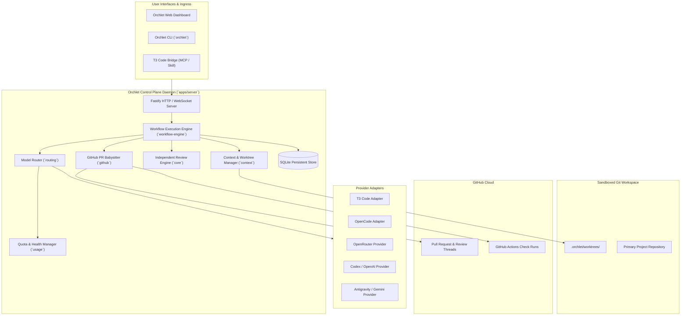
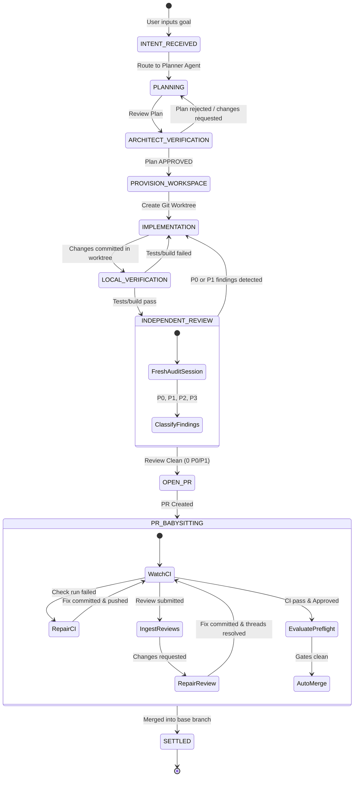

# Orchlet Architecture Specification

> **Orchlet**: Production-minded, open-source AI coding-agent orchestration control plane.
> Let the developer state the desired outcome once. Orchlet automatically plans the work, chooses the most economical and capable models, implements changes in an isolated Git worktree, tests them, conducts independent adversarial review, opens and babysits a GitHub PR through CI and review feedback, and reaches a clean merge-ready state.

---

## 1. Architectural Principles & Tenets

1. **Outcome-Driven Autonomy**: The developer provides intent. The system determines execution strategy, decomposes steps, allocates specialized subagents, and handles verification.
2. **Economic Optimization & Quota Intelligence**:
   - Default routing mode is **`AUTO`**: Achieve the best reasonable result for the lowest reasonable cost.
   - Dynamic tiering (`fast`, `balanced`, `strong`) prevents high-cost models from burning quota on low-complexity tasks (e.g. summaries, file scans, simple patches).
   - Proactive tracking of subscription quota windows (5-hour burst, 7-day rolling, monthly credits) routes around depleted pools before `429` rate limits crash execution.
3. **Strict Plan-Before-Mutation Sandboxing**:
   - Planning, architectural analysis, and adversarial review are **read-only** operations.
   - Mutations occur exclusively inside ephemeral **Git Worktrees** (`.orchlet/worktrees/<task-id>`), preventing file contention with the developer's primary working tree.
4. **Independent Multi-Agent Review (P0–P3 Severity)**:
   - Code review is never performed by the implementing agent.
   - A fresh, unpolluted reviewer session audits the git diff against acceptance criteria, invariants, and security guidelines.
   - Review findings are structured into `P0` (blocker), `P1` (critical defect), `P2` (improvement/debt), and `P3` (minor nit). `P0` and `P1` findings automatically trigger a targeted fix cycle.
5. **PR Lifecycle Ownership ("Babysitter")**:
   - The orchestrator does not stop when a PR is created.
   - It monitors CI check suites with jittered exponential backoff, extracts high-signal error annotations and log tails, triggers automated fixes for failing tests, clusters maintainer review comments by file, and safely executes preflight merge gates.
6. **Crash Recoverability & Event Sourcing**:
   - All state transitions, turns, and checkpoints are persisted to a local, crash-resilient SQLite database.
   - If the daemon crashes or restarts, active tasks resume from their last settled checkpoint without token duplication.
7. **Provider & Harness Independence**:
   - Orchlet does not fork or depend on any single editor or proprietary runtime.
   - Pluggable adapters (`@orchlet/t3-adapter`, `@orchlet/providers`) abstract T3 Code, OpenCode, Codex, Google Antigravity/Gemini, and Anthropic Claude behind standard contracts.
8. **Privacy-Aware Routing & Self-Hosting**:
   - Local policies dictate whether sensitive files or proprietary code can leave the machine.
   - Zero telemetry leaks: No personal usernames, local file paths, or API keys are embedded in commits or external logs.

---

## 2. High-Level System Architecture



---

## 3. Workflow State Machine

Orchlet organizes task execution into deterministic, verifiable stages:



### Attention State Classification
To prevent false alarms while subagent swarms are computing:
- **`RUNNING`**: Active LLM inference or tool execution occurring on primary turn.
- **`WAITING_ON_AGENTS`**: Parent orchestrator paused while subagents, test runners, or CI suites execute.
- **`NEEDS_ATTENTION`**: Human approval required (e.g. destructive command, security gate, or P0 review disagreement).
- **`SETTLED`**: Goal fully accomplished, merged, or paused.

---

## 4. Routing Engine & Modes

### Routing Modes
- **`AUTO` (Default)**: Automatically selects the most cost-effective model that meets the capability requirement of the current role.
- **`CHEAP`**: Restricts execution to lightweight models (`fast` tier) and local models.
- **`QUALITY`**: Prefers `balanced` for implementation and `strong` for architecture and review.
- **`BEST`**: Allocates maximum reasoning effort models (`strong` tier thinking models) across all phases.
- **`MANUAL`**: Adheres strictly to developer-specified model overrides.

### Role & Model Allocation Matrix

| Workflow Phase | Default Role | Compute Tier | Capabilities Required |
| :--- | :--- | :--- | :--- |
| **Task Planning** | `planner` | `balanced` | Strong instruction following, repository decomposition |
| **Architecture Audit** | `architect` | `strong` | High reasoning effort, dependency analysis, read-only |
| **Code Implementation** | `executor` | `balanced` | Fast tool execution, file editing, precise diff creation |
| **Independent Review** | `critic` | `strong` | Adversarial reasoning, security vulnerability detection |
| **CI Repair** | `repairer` | `fast` / `balanced` | Targeted error parsing, compiler fix application |

---

## 5. Monorepo Architecture (`pnpm` workspace)

```
Orchlet/
 ├── apps/
 │    ├── server/             # Control plane daemon (Fastify, WebSocket, SQLite, Engine)
 │    └── dashboard/          # Modern Web UI (Vite, React, Tailwind, streaming state)
 ├── packages/
 │    ├── core/               # Domain models, task entities, state machines, interfaces
 │    ├── workflow-engine/    # Orchestrator loop, task execution, checkpoint manager
 │    ├── routing/            # Model router, tier resolution, provider fallback chains
 │    ├── context/            # Worktree isolation, AGENTS.md upward discovery, repo index
 │    ├── github/             # PR babysitter, CI poll backoff, log extract, safe merge gates
 │    ├── t3-adapter/         # T3 Code HTTP/WebSocket RPC client & MCP bridge
 │    ├── providers/          # OpenRouter, OpenAI/Codex, Google Gemini, Anthropic adapters
 │    ├── usage/              # Quota windows, 5h/weekly tracking, health state calculator
 │    ├── notifications/      # Attention state notifier (OS native, Webhook, Sound)
 │    └── shared/             # Common utilities, logger, schemas, result types
 ├── docs/
 │    ├── ARCHITECTURE.md     # This document
 │    ├── research/           # Phase 0 deep-dive reports
 │    └── adr/                # Architecture Decision Records
 ├── pnpm-workspace.yaml
 ├── package.json
 ├── tsconfig.json
 └── LICENSE (MIT)
```

---

## 6. Independent Review Contract & Severity Taxonomy

Independent reviews are generated in strict JSON/Markdown format:

```typescript
export interface ReviewFinding {
  id: string;
  severity: "P0" | "P1" | "P2" | "P3";
  title: string;
  filePath: string;
  lineRange?: { start: number; end: number };
  description: string;
  suggestedFix?: string;
  securityImpact?: boolean;
}

export interface ReviewVerdict {
  verdict: "APPROVED" | "CHANGES_REQUESTED" | "BLOCKED";
  findings: ReviewFinding[];
  summary: string;
  reviewedCommit: string;
  reviewerModel: string;
  timestamp: string;
}
```

- **`P0` (Blocker)**: Critical safety defect, security vulnerability, data corruption hazard, or complete functional regression. **Must be resolved before PR.**
- **`P1` (Critical Defect)**: Failing edge case, broken test, violation of monorepo conventions. **Must be resolved before PR.**
- **`P2` (Improvement / Tech Debt)**: Code readability, performance optimization, non-blocking refactor. Logged in PR description.
- **`P3` (Minor Nit)**: Typo, stylistic preference. Optional.

---

## 7. Crash Recovery & Resilience Architecture

1. **Transactional Checkpointing**: Before executing any tool mutation or turn, Orchlet commits a checkpoint row into SQLite (`task_id`, `step_index`, `git_ref`, `status`).
2. **Deterministic Resume**: On daemon startup, Orchlet queries for tasks with status in `['RUNNING', 'WAITING_ON_AGENTS']`:
   - Inspects the assigned worktree's git status.
   - If clean, resumes the current step.
   - If uncommitted changes exist, generates a recovery commit or reverts to the last verified checkpoint ref.
3. **No Duplicate API Billing**: Resumed steps reuse persisted planning and turn artifacts rather than repeating prompt generation.
