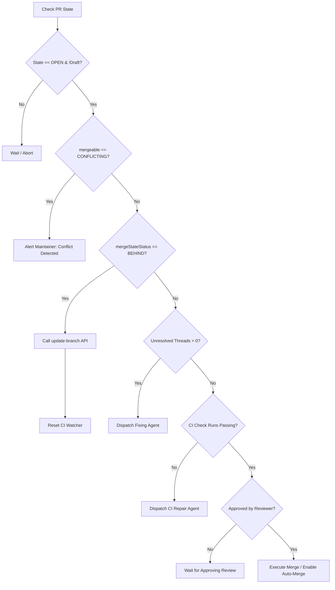

# GitHub PR, CI & Review Babysitting: Protocols, State Machine & Algorithms

## 1. Executive Summary

Autonomous coding orchestration is not complete when a Pull Request is opened. Orchlet owns the workflow until one of four terminal conditions is reached:
1. **Merged** (clean, passing CI, approved, merged into base branch).
2. **Explicitly Abandoned** (by maintainer request or unrecoverable conflict).
3. **Manually Paused** (maintainer intervenes to take manual control).
4. **Irrecoverably Failed** (max retry budget exhausted).

This document outlines Orchlet's architecture for GitHub API/CLI integration, CI polling with adaptive jittered backoff, inline review intake and file-based clustering, diagnostic log extraction, and autonomous safe gate preflights.

---

## 2. API & Transport Architecture: Octokit vs. `gh` CLI

Self-hosted orchestrators typically run behind local NATs without inbound webhook ingress. Orchlet employs a **Hybrid In-Process Octokit + Local Keyring** architecture:

1. **Authentication**: Resolves GitHub credentials dynamically from the local GitHub CLI keyring via `gh auth token`. No static PATs or tokens need to be stored in cleartext.
2. **Consolidated State Ingestion (GraphQL)**: Uses in-process Octokit GraphQL to fetch PR metadata, commit status rollup, CI check runs, review approvals, and unresolved code threads in a **single HTTP roundtrip** (~1 resource point, 20–80ms) rather than spawning 4 separate CLI subprocesses.
3. **Selective Fast Log Extraction**: Uses Octokit REST for check run annotations (`/annotations`), falling back to `gh run view <id> --log-failed` for compact failure summaries when full logs are needed.

---

## 3. Polling Engine with Jittered Exponential Backoff

GitHub enforces rate limits (5,000 req/hr for REST/GraphQL). To conserve quota while responding promptly to CI transitions:

- **Warmup Phase (0 to 45s post-push)**: CI workflows register and queue. Interval: 15s.
- **Active Build Phase (45s to 10m)**: Workflows running. Interval: 25s, exponentially increasing to 60s with 15% random jitter.
- **Deep Test Phase (>10m)**: Long integration suites. Interval: 60s to 120s with jitter.
- **Rate-Limit Guard**: If `x-ratelimit-remaining` falls below 500, intervals dynamically double. Below 100, polling halts until `x-ratelimit-reset`.

```typescript
export function computeNextPollInterval(
  attempt: number,
  rateLimitRemaining: number
): number {
  if (rateLimitRemaining < 200) return 180_000;
  if (rateLimitRemaining < 500) return 90_000;

  const base = Math.min(15_000 * Math.pow(1.35, attempt), 120_000);
  const jitter = 0.85 + Math.random() * 0.3; // ±15%
  return Math.round(base * jitter);
}
```

---

## 4. Review Comment Intake, Clustering & Thread Resolution

When maintainers or independent reviewers post feedback, comments must be deduplicated and organized cleanly for the fixing agent:

1. **Security Fencing**: Only process comments and change requests from trusted author associations (`OWNER`, `MEMBER`, `COLLABORATOR`). Untrusted comments are quarantined.
2. **File Clustering**: Rather than dispatching fixing agents on isolated comments, unresolved threads are grouped by file path (`ReviewCommentCluster`).
3. **Data Sandboxing**: External comment text is enclosed in strict `<untrusted_review_content>` XML fences in the fixing prompt to defend against indirect prompt injections.
4. **Resolution Mutation**: Upon pushing a verified fix commit, Orchlet executes the GraphQL mutation `resolveReviewThread` to mark resolved items cleanly on GitHub.

---

## 5. Diagnostic Log Extraction Pipeline

Massive CI log archives (often megabytes in size) contain ANSI escape sequences, setup boilerplate, and timestamp noise. Orchlet filters diagnostics through a three-stage pipeline:
1. **Annotation First**: Queries `GET /check-runs/:id/annotations`. Linter and compiler errors (e.g. ESLint, `tsc`, pytest) are already extracted at specific line numbers, eliminating 99% of token overhead.
2. **ANSI & Timestamp Stripping**: Strips control codes and ISO timestamps via regex.
3. **Sliding Error Window**: Scans for error anchors (`FAIL`, `Error:`, `AssertionError`, `process completed with exit code`) and extracts a 100-line context window preceding and following the failure.

---

## 6. Preflight Safe Gate Matrix & Merge Autonomy

Before attempting any merge operation, Orchlet executes strict preflight verification:



---

## 7. Security Hardening

1. **Workflow File Sandboxing**: Subagents are strictly blocked from writing to `.github/workflows/**` or editing CI configurations to prevent privilege escalation or secret leakage.
2. **Masked Credentials**: Dynamic tokens retrieved via `gh auth token` are kept in memory and masked from all agent logs, scratchpads, and execution traces.
